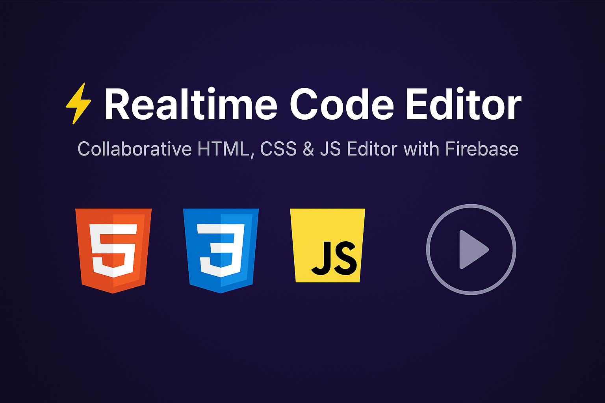

# ⚡ Realtime Code Editor



A collaborative **online HTML, CSS, and JavaScript editor** with live preview, powered by **Firebase Realtime Database**.  
Multiple users can edit code together and see changes instantly.

---

## ✨ Features
- 🖊️ **Live Editing** — Code in HTML, CSS, and JavaScript with instant preview.
- 🔄 **Realtime Collaboration** — Multiple users can edit the same document together.
- 💾 **Save & Run** — Manual save and one-click run functionality.
- ⚡ **Auto-Run Toggle** — Choose between manual or automatic rendering.
- 🖥️ **Console Output** — Built-in console for logs, warnings, and errors.
- 🎨 **Modern UI** — Dark-themed editor with CodeMirror, status bar, and icons.
- 🌐 **Firebase Powered** — Realtime sync across browsers.

---

## 🛠️ Tech Stack
- [HTML5](https://developer.mozilla.org/docs/Web/HTML)
- [CSS3 + TailwindCSS](https://tailwindcss.com/)
- [JavaScript (ES6)](https://developer.mozilla.org/docs/Web/JavaScript)
- [CodeMirror](https://codemirror.net/) for code editing
- [Firebase Realtime Database](https://firebase.google.com/docs/database) for live sync
- [Lucide Icons](https://lucide.dev/) for UI icons

---

## 🚀 Getting Started

### 1. Clone the Repository
```bash
git clone https://github.com/subodh-git77/realtime-code-editor.git
cd realtime-code-editor
